# Entity Relationship Diagram — Pikitup Platform Database

Database: `pikitup` (PostgreSQL 15+)
ORM: Prisma v7 with `@prisma/adapter-pg`

---

## Mermaid ERD

```mermaid
erDiagram

    EXECUTIVES {
        String  id          PK  "cuid()"
        String  name
        String  title
        String  abbreviation
        String  department
        Text    bio
        String  imageUrl    "nullable"
        String  email       "nullable"
        Int     order       "default 99"
        DateTime createdAt  "default now()"
        DateTime updatedAt
    }

    GENERAL_MANAGERS {
        String  id          PK  "cuid()"
        String  name
        String  cluster
        String  imageUrl    "nullable"
        Int     order       "default 99"
        DateTime createdAt  "default now()"
        DateTime updatedAt
    }

    DEPOT_MANAGERS {
        String  id          PK  "cuid()"
        String  name
        String  depot
        String  role
        String  imageUrl    "nullable"
        Int     order       "default 99"
        DateTime createdAt  "default now()"
        DateTime updatedAt
    }

    DEPOTS {
        String  id      PK  "cuid()"
        String  name    "unique"
        Int     order   "default 99"
    }

    ARTICLES {
        String   id          PK  "cuid()"
        String   title
        String   slug        "unique"
        String   category    "default News"
        Text     excerpt
        Text     body
        String   status      "default draft"
        String   author
        String   imageUrl    "nullable"
        String   region      "nullable, default All"
        String   tags        "nullable"
        Int      views       "default 0"
        DateTime publishedAt "nullable"
        DateTime scheduledAt "nullable"
        DateTime createdAt   "default now()"
        DateTime updatedAt
    }

    NOTICES {
        String   id        PK  "cuid()"
        String   title
        Text     body
        String   type      "default info"
        String   region    "default All Regions"
        Boolean  active    "default true"
        DateTime expiresAt "nullable"
        DateTime createdAt "default now()"
        DateTime updatedAt
    }

    ANNUAL_REPORTS {
        String  id          PK  "cuid()"
        String  title
        String  year
        String  type        "default Integrated Annual Report"
        Text    description
        Int     pages       "nullable"
        String  pdfUrl      "nullable"
        String  viewUrl     "nullable"
        Boolean isLatest    "default false"
        Int     order       "default 99"
        DateTime createdAt  "default now()"
        DateTime updatedAt
    }

    CORPORATE_DOCUMENTS {
        String  id          PK  "cuid()"
        String  title
        Text    description
        String  category    "default Corporate"
        String  fileUrl     "nullable"
        Int     order       "default 99"
        DateTime createdAt  "default now()"
        DateTime updatedAt
    }
```



> **Note:** All models are independent (no foreign key relationships) in v1.0. Relationships between entities are managed at the application layer. Future versions will add FK constraints (e.g. `DepotManager.depotId → Depot.id`).

---

## Table Definitions

### `executives`

Stores Pikitup's senior executive team (CEO, CFO, COO, etc.).

| Column | Type | Constraints | Notes |
|---|---|---|---|
| `id` | `varchar` | PK | CUID generated |
| `name` | `varchar` | NOT NULL | Full name |
| `title` | `varchar` | NOT NULL | Job title |
| `abbreviation` | `varchar` | NOT NULL | Short form (e.g. CEO) |
| `department` | `varchar` | NOT NULL | Division name |
| `bio` | `text` | NOT NULL | Biographical content |
| `imageUrl` | `varchar` | NULLABLE | Portrait photo URL |
| `email` | `varchar` | NULLABLE | Contact email |
| `order` | `integer` | DEFAULT 99 | Display sort order |
| `createdAt` | `timestamptz` | DEFAULT now() | |
| `updatedAt` | `timestamptz` | Auto-updated | |

---

### `general_managers`

General Managers assigned to operational clusters.

| Column | Type | Constraints | Notes |
|---|---|---|---|
| `id` | `varchar` | PK | CUID |
| `name` | `varchar` | NOT NULL | |
| `cluster` | `varchar` | NOT NULL | Cluster/region name |
| `imageUrl` | `varchar` | NULLABLE | |
| `order` | `integer` | DEFAULT 99 | |
| `createdAt` | `timestamptz` | DEFAULT now() | |
| `updatedAt` | `timestamptz` | Auto-updated | |

---

### `depot_managers`

Managers assigned to specific operational depots.

| Column | Type | Constraints | Notes |
|---|---|---|---|
| `id` | `varchar` | PK | CUID |
| `name` | `varchar` | NOT NULL | |
| `depot` | `varchar` | NOT NULL | Depot name (freetext in v1.0) |
| `role` | `varchar` | NOT NULL | Specific role at depot |
| `imageUrl` | `varchar` | NULLABLE | |
| `order` | `integer` | DEFAULT 99 | |
| `createdAt` | `timestamptz` | DEFAULT now() | |
| `updatedAt` | `timestamptz` | Auto-updated | |

---

### `depots`

Registry of Pikitup operational depots (name reference only in v1.0).

| Column | Type | Constraints | Notes |
|---|---|---|---|
| `id` | `varchar` | PK | CUID |
| `name` | `varchar` | UNIQUE, NOT NULL | |
| `order` | `integer` | DEFAULT 99 | |

---

### `articles`

News articles and press releases managed via the CMS.

| Column | Type | Constraints | Notes |
|---|---|---|---|
| `id` | `varchar` | PK | CUID |
| `title` | `varchar` | NOT NULL | |
| `slug` | `varchar` | UNIQUE, NOT NULL | URL slug |
| `category` | `varchar` | DEFAULT `News` | News / Press Release / Update |
| `excerpt` | `text` | NOT NULL | Short summary |
| `body` | `text` | NOT NULL | Full article HTML/Markdown |
| `status` | `varchar` | DEFAULT `draft` | `draft` / `published` |
| `author` | `varchar` | NOT NULL | Author name |
| `imageUrl` | `varchar` | NULLABLE | Hero image URL |
| `region` | `varchar` | DEFAULT `All` | Targeted region |
| `tags` | `varchar` | NULLABLE | Comma-separated tags |
| `views` | `integer` | DEFAULT 0 | View count |
| `publishedAt` | `timestamptz` | NULLABLE | Publication timestamp |
| `scheduledAt` | `timestamptz` | NULLABLE | Scheduled publish time |
| `createdAt` | `timestamptz` | DEFAULT now() | |
| `updatedAt` | `timestamptz` | Auto-updated | |

---

### `notices`

Service notices and alerts displayed on the public website.

| Column | Type | Constraints | Notes |
|---|---|---|---|
| `id` | `varchar` | PK | CUID |
| `title` | `varchar` | NOT NULL | |
| `body` | `text` | NOT NULL | Notice content |
| `type` | `varchar` | DEFAULT `info` | `info` / `warning` / `critical` |
| `region` | `varchar` | DEFAULT `All Regions` | Region scope |
| `active` | `boolean` | DEFAULT `true` | Visibility toggle |
| `expiresAt` | `timestamptz` | NULLABLE | Auto-deactivation time |
| `createdAt` | `timestamptz` | DEFAULT now() | |
| `updatedAt` | `timestamptz` | Auto-updated | |

---

### `annual_reports`

Pikitup integrated annual report metadata.

| Column | Type | Constraints | Notes |
|---|---|---|---|
| `id` | `varchar` | PK | CUID |
| `title` | `varchar` | NOT NULL | Full report title |
| `year` | `varchar` | NOT NULL | e.g. `2023/2024` |
| `type` | `varchar` | DEFAULT `Integrated Annual Report` | Report classification |
| `description` | `text` | NOT NULL | Summary description |
| `pages` | `integer` | NULLABLE | Page count |
| `pdfUrl` | `varchar` | NULLABLE | Download URL for PDF |
| `viewUrl` | `varchar` | NULLABLE | Online viewer URL |
| `isLatest` | `boolean` | DEFAULT `false` | Only one record may be `true` |
| `order` | `integer` | DEFAULT 99 | Display order |
| `createdAt` | `timestamptz` | DEFAULT now() | |
| `updatedAt` | `timestamptz` | Auto-updated | |

**Business rule:** When a report is set as `isLatest = true` via the API, all other records are first set to `isLatest = false` to enforce exclusivity.

---

### `corporate_documents`

Policy, governance and strategy documents catalogue.

| Column | Type | Constraints | Notes |
|---|---|---|---|
| `id` | `varchar` | PK | CUID |
| `title` | `varchar` | NOT NULL | Document title |
| `description` | `text` | NOT NULL | Brief description |
| `category` | `varchar` | DEFAULT `Corporate` | `Governance` / `Financial` / `Strategic` / `Operational` |
| `fileUrl` | `varchar` | NULLABLE | Download URL |
| `order` | `integer` | DEFAULT 99 | Display order |
| `createdAt` | `timestamptz` | DEFAULT now() | |
| `updatedAt` | `timestamptz` | Auto-updated | |

---

## Migration History

| Migration ID | Date | Description |
|---|---|---|
| `20260622155502_init` | 2026-06-22 | Initial schema: executives, general_managers, depot_managers, depots |
| `20260622163512_add_articles_notices` | 2026-06-22 | Added: articles, notices |
| `20260623082941_add_annual_reports` | 2026-06-23 | Added: annual_reports, corporate_documents |

---

## Planned Future Models (v1.1+)

```
Complaint         ← Service complaints from residents/businesses
User              ← Authenticated portal users (residents, businesses, staff)
JobVacancy        ← Career portal job listings
JobApplication    ← Career portal applications
Facility          ← Pikitup facility locations with coordinates
CollectionArea    ← Collection schedule zones and days
Tender            ← Tenders and RFQ listings
```
